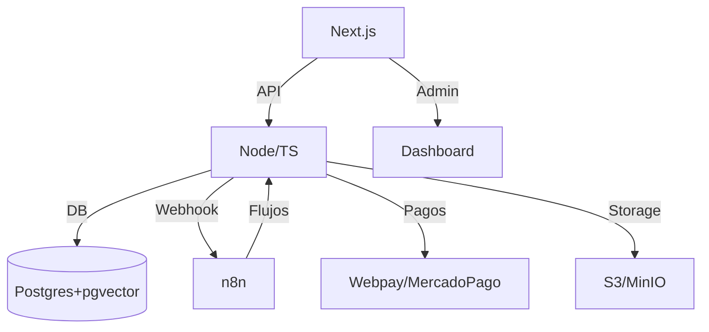

# Arquitectura MVP SaaS Ventas 24/7

## Decisiones Clave (ADR-0001)
- Infraestructura Hetzner + EasyPanel para MVP, Azure Chile para producción.
- Servicios desacoplados vía Docker Compose.
- IA: OpenAI API por defecto, opción local LLM futuro.
- Pagos: Webpay sandbox, Mercado Pago alternativa.
- Consentimiento granular y endpoints legales desde el inicio.

## Supuestos
- Express para API, Next.js para web, Postgres 15 + pgvector.
- n8n expuesto por reverse proxy, flujos versionados en JSON.
- TODOs y diferencias de alcance se documentan en Issues.
